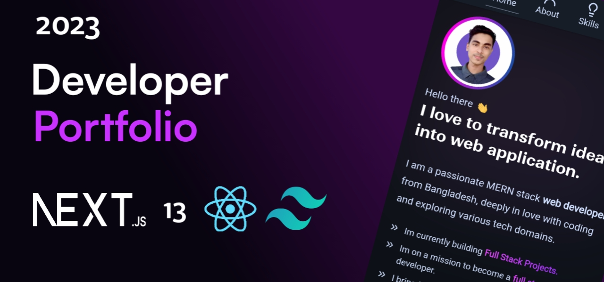

# My Portfolio

My personal portfolio website built with Next.js & Tailwind CSS. Explore my projects, skills, and journey as a MERN stack developer. Let's connect and build the future together

## About Me

I am Adarsh kr Tiwari, a web enthusiast from New delhi , deeply in love with coding and transforming ideas into web applications. My expertise lies in the MERN stack, and I'm on a mission to become a modern full stack developer.

## 🔴 Unveiling the Journey of Building This Portfolio
> [!Note]
> In my quest to design my portfolio, I faced the challenge of limited design knowledge. After exploring various portfolios for inspiration, I finally crafted mine using Next.js and Tailwind CSS. This journey taught me the importance of perseverance and adaptability, showcasing my commitment to enhancing both coding and design skills in the ever-evolving world of web development.

### Project Created at
- 🗓 *Dec 2024 - Jan 2025*

### Technologies Used 🛠️

- Next.js
- Tailwind CSS
- React-Spring
- React-Hot-Toast
- sweetalert2

### Key Features

- **💡 Skills:** Check out my proficiency in web development technologies.
- **🎯 Projects:** Explore a collection of full-stack projects.
- **✍️ Blogs:** Dive into insightful tech blogs I've written.
- **☎️ Contact:** Connect with me for collaborations, inquiries, or discussions.

### Live Demo 🎉
Explore the live version of this Portfolio [here](https://updated-cv-three.vercel.app/?source=portfolio_repo).

### 📬 Connect with me
> Let's connect! Reach out for collaborations, projects, or just a friendly chat.

*Feel free to explore, contribute, and get inspired!*